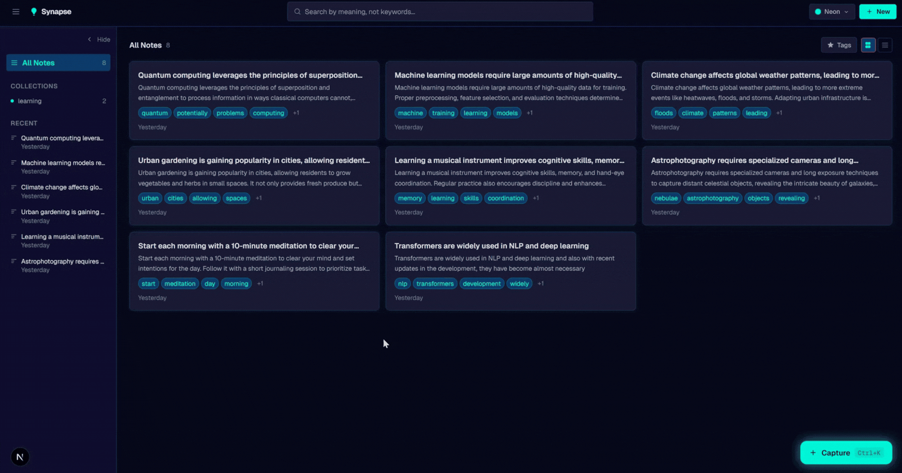
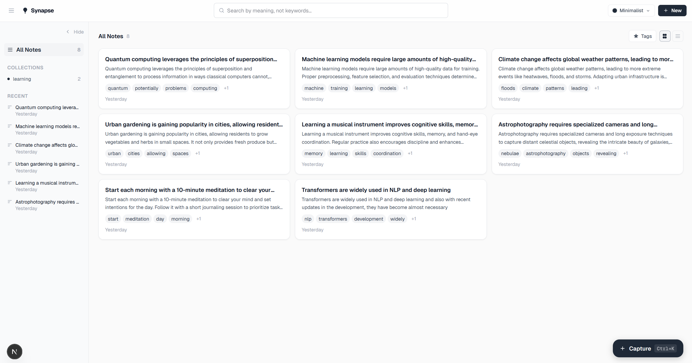
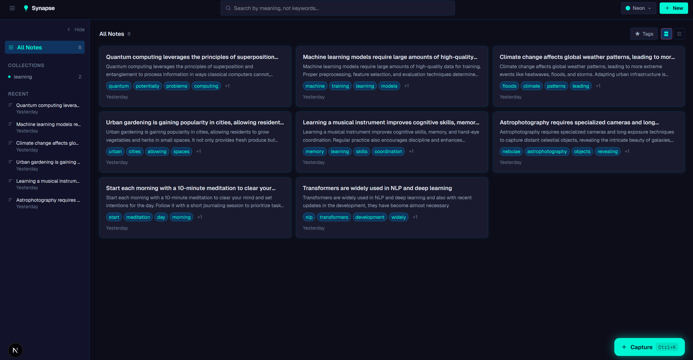

# Personal Knowledge Base

> Write freely. Find anything - by meaning, not keywords.

---

## 🎬 See It in Action

> **Quick Preview**



---

## 📸 Screenshots

### The Minimalist Theme



---

### Neon Theme



---

## What makes this different

Most note apps search by **keywords**. This one searches by **meaning**.

Write a note in plain language. The backend splits it into overlapping chunks, embeds each one through `all-MiniLM-L6-v2`, and stores 384-dimensional vectors in PostgreSQL. When you search, your query goes through the exact same pipeline - the database finds chunks that are *geometrically close* using cosine distance.

Searching `"feeling overwhelmed"` can surface a note titled *"My Calendar Works Against Me"* whose body says *"back-to-back commitments produce the least output"* - no shared vocabulary, just the same region of meaning-space.

Bonus: **related notes** surface conceptually adjacent notes automatically. Write enough and the connections build themselves - no manual tagging or linking required.

---

## How it works

```
You type a note
      │
      ▼
  raw_content split into overlapping text chunks
      │
      ▼
  each chunk → all-MiniLM-L6-v2 → 384-dim vector (L2-normalized)
      │
      ▼
  stored in PostgreSQL + pgvector  (note_chunks table)


  Search query → same model → same 384-dim vector
      │
      ▼
  SELECT ... ORDER BY embedding <=> query_vector  (cosine distance)
  CTE deduplicates - one result per note, ranked by best chunk match
      │
      ▼
  ranked results with relevance score → Next.js frontend
```

### Embedding model at a glance

| Property | Value |
|---|---|
| Model | `all-MiniLM-L6-v2` |
| Library | `sentence-transformers` |
| Dimensions | 384 |
| Normalization | L2 - cosine similarity reduces to a dot product |
| Device | CUDA if available, CPU fallback |
| Loading | Lazy singleton, warmed up at startup - no cold-start on first request |

---

## Stack

| Layer | Tech |
|---|---|
| Backend | FastAPI + SQLAlchemy |
| Embeddings | SentenceTransformers `all-MiniLM-L6-v2` |
| Vector store | PostgreSQL + pgvector (Neon serverless) |
| Frontend | Next.js + Tailwind CSS (dark mode + theme switcher) |
| Production | Render (API) + Vercel (frontend) |

---

## Running locally

**Prerequisites:** Docker, Node.js 18+, a [Neon](https://neon.tech) database (free tier works).

### 1. Backend

```bash
cp backend/.env.example backend/.env
# open backend/.env and fill in DATABASE_URL with your Neon connection string
docker compose up --build
```

Backend is live at `http://localhost:8000`. Check `GET /health` to confirm the model loaded.

### 2. Frontend

```bash
cd frontend
cp .env.local.example .env.local   # sets NEXT_PUBLIC_API_URL=http://localhost:8000
npm install
npm run dev
```

Frontend is live at `http://localhost:3000`.

That's it. No tunnels, no external tools needed.

---

## Deploying

### Backend → Render

1. Connect your repo to [Render](https://render.com) and create a new **Web Service**
2. Set the root directory to `backend/`
3. Set the start command to: `uvicorn app.main:app --host 0.0.0.0 --port $PORT`
4. Add environment variable: `DATABASE_URL` = your Neon connection string

### Frontend → Vercel

1. Connect your repo to [Vercel](https://vercel.com)
2. Set the root directory to `frontend/`
3. Add environment variable: `NEXT_PUBLIC_API_URL` = your Render backend URL

---

## API reference

```
POST   /notes                      Create note (auto-chunks + embeds)
GET    /notes                      List all notes
GET    /notes/{id}                 Single note
PATCH  /notes/{id}                 Update title
PUT    /notes/{id}/content         Replace content (re-ingests, re-embeds)
DELETE /notes/{id}                 Delete note + chunks + tags

GET    /notes/search?q=your+query  Semantic search across all chunks
GET    /search/related/{note_id}   Notes semantically similar to a given note

GET    /health                     Model name, dims, env
```

---

## Project structure

```
backend/app/
  main.py            lifespan startup, CORS, global error handler
  config.py          pydantic-settings - all config via env vars
  database.py        SQLAlchemy engine + session
  models.py          Note, NoteChunk, NoteTag ORM models
  embeddings.py      EmbeddingService singleton
  routers/
    notes.py         CRUD endpoints
    search.py        semantic search + related notes

frontend/            Next.js app (theme switcher, search UI)
database/
  init.sql           schema + pgvector setup
  seed.sql           sample notes
docker-compose.yml   local backend container
```

---

## License

MIT
